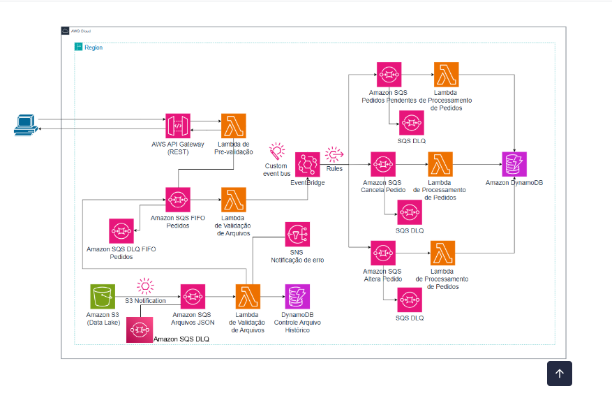

# Semana do Desenvolvedor AWS | Escola da Nuvem 🚀
## Trilha AWS Certified Developer – Associate

Repositório criado para centralizar e documentar todos os laboratórios, projetos práticos e desafios desenvolvidos durante a **Semana do Desenvolvedor AWS**, promovida pela **Escola da Nuvem**. 

O objetivo desta trilha é solidificar os conceitos de desenvolvimento focado em nuvem utilizando o ecossistema AWS, aplicando boas práticas de arquiteturas serverless, desacoplamento de sistemas, microsserviços e segurança (IAM).

---

## 🛠️ Tecnologias, Serviços e Ferramentas Utilizados

* **Linguagem Principal:** Python 3.12 (Boto3)
* **Computação Serverless:** AWS Lambda
* **Mensageria e Integração:** Amazon SQS (Fila FIFO e DLQ) & Amazon EventBridge
* **Exposição de Endpoints:** Amazon API Gateway (REST API)
* **Monitoramento e Logs:** Amazon CloudWatch
* **Controle de Acesso:** AWS IAM (Identity and Access Management)

---

## 📐 Arquitetura Geral do Ecossistema

À medida que o laboratório avança, a arquitetura ganha novas camadas de ingestão, processamento e desacoplamento para simular um ambiente de produção real.

---

### 📂 Organização do Repositório

O projeto está dividido por dias e módulos focados, cada um contendo seus respectivos códigos de funções e documentação de infraestrutura:

| Módulo / Dia | Descrição do Laboratório | Status |
| :--- | :--- | :--- |
| **📅 Dia 01: Ingestão de Pedidos** | API Gateway REST, Pré-validação com Lambda, Filas SQS FIFO e publicação de eventos customizados no EventBridge. | 🟢 Concluído |
| **📅 Dia 02: Ingestão em Lote** | Ingestão em lotes de arquivos contendo múltiplos pedidos através de buckets do Amazon S3. | ⏳ Pendente |
| **📅 Dia 03: Processamento** | Em breve... | ⏳ Pendente |

---

## 🚀 Como Executar os Testes

Os testes de integração e envio de payloads para os endpoints criados utilizam comandos via terminal com `curl`. 

Para instruções detalhadas de como provisionar a infraestrutura e rodar cada componente localmente ou na AWS, acesse o `README.md` específico localizado dentro da pasta de cada dia.

---

## 🧑‍💻 Autora

* **Giane Costa**
* 💼 **Formação:** Análise e Desenvolvimento de Sistemas (ADS) - UNINTER
* ☁️ **Especialização:** AWS Developer Associate - Escola da Nuvem
* 🔗 **LinkedIn:** [giane-costa](https://www.linkedin.com/in/giane-costa/)

---
*Este projeto possui fins estritamente educacionais associados à preparação para a certificação AWS Certified Developer – Associate.*
