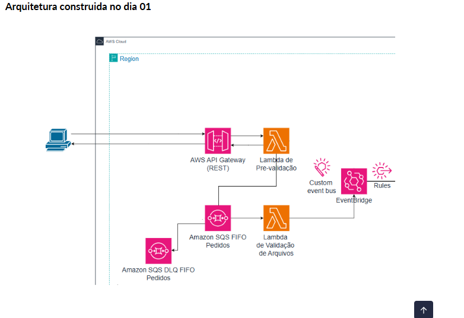

# Desafio Dia 01: Ingestão de Pedidos via API e EventBridge 📨

Este módulo compreende a primeira etapa do ecossistema de microsserviços e mensageria serverless construído durante a **Semana do Desenvolvedor AWS** da **Escola da Nuvem**. O foco principal deste dia foi estabelecer um fluxo de entrada assíncrono e resiliente para o recebimento de pedidos.

---

## 📐 Arquitetura do Dia 01

O fluxo desenhado e implementado para esta etapa segue a sequência abaixo:

1. Um cliente envia uma requisição HTTP POST com o payload do pedido para o endpoint exposto pelo **Amazon API Gateway**.
2. O API Gateway atua como proxy, encaminhando o payload diretamente e acionando a função **Lambda de Pré-Validação**.
3. A Lambda de Pré-Validação verifica os campos mandatórios (`pedidoId` e `clienteId`). Se válidos, enfileira o objeto no **Amazon SQS FIFO**, garantindo a ordenação estrita por grupo de mensagens.
4. Mensagens que falham repetidamente são isoladas na fila de mensagens mortas (**SQS FIFO DLQ**).
5. A segunda função **Lambda de Validação** consome as mensagens da fila via *polling* ativo (com tamanho de lote configurado em 1), realiza uma validação minuciosa dos itens e publica o evento com sucesso no barramento customizado do **Amazon EventBridge**.



---

## 🛠️ Serviços Utilizados e Padrão de Infraestrutura

Para a construção desse microsserviço, os seguintes componentes foram provisionados e integrados:

* **Entrypoint API REST:** Criado no Amazon API Gateway para recepção síncrona de requisições externas via método `POST` com integração do tipo Lambda Proxy.
* **Lambda de Triagem (Pré-Validação):** Responsável pelo tratamento inicial do payload e isolamento de requisições malformadas antes do enfileiramento.
* **Filas de Mensageria (SQS FIFO):** Arquitetura baseada em fila principal First-In, First-Out para garantir a consistência e ordem sequencial dos dados, integrada a uma Dead Letter Queue (DLQ) configurada para até 3 tentativas de reprocessamento.
* **Lambda de Processamento (Validação):** Consumidor configurado com *Batch Size = 1* para respeitar a integridade da fila FIFO, validação detalhada do modelo de dados e tratamento de exceções.
* **Barramento de Eventos (EventBridge):** Criação de um Custom Event Bus para servir como o núcleo de distribuição e desacoplamento do ecossistema.

---

## ⚙️ Políticas do IAM e Permissões (Segurança Coerente)

Seguindo o princípio do privilégio mínimo, as permissões de execução foram estendidas através de políticas inline e gerenciadas:

### Lambda de Pré-Validação
* Permissão básica de execução para escrita de logs no Amazon CloudWatch.
* Permissão customizada para ação `sqs:SendMessage` restrita ao recurso da fila principal.

### Lambda de Validação de Pedidos
* Permissão para consumo e deleção de mensagens através da política gerenciada de execução SQS da AWS.
* Permissão para publicação no barramento de eventos através da ação `events:PutEvents`.

---

## 🚀 Como Testar a Ingestão

Para disparar o fluxo de ponta a ponta e testar a resiliência das filas e barramentos, execute o seguinte comando `curl` no terminal (substituindo pelos dados de endpoint da sua infraestrutura):

```bash
curl -X POST https://<ID_DA_SUA_API>.execute-api.<SUA_REGIAO>[.amazonaws.com/dev/pedidos](https://.amazonaws.com/dev/pedidos) \
 -H "Content-Type: application/json" \
 -d '{
   "pedidoId": "id-pedido-teste",
   "clienteId": "id-cliente-teste",
   "itens": [
     {"produto": "Item Exemplo A", "quantidade": 5},
     {"produto": "Item Exemplo B", "quantidade": 10}
   ]
 }'
```
## ✅ Validação do Sucesso

1. **HTTP Status 200 OK:** A API deve retornar um JSON contendo a mensagem de sucesso e o respectivo identificador único da mensagem gerado pelo SQS (`sqsMessageId`).
2. **CloudWatch Logs:** O log group da Lambda de validação final deve registrar a captura do evento, o processamento bem-sucedido e o retorno positivo do EventBridge (`FailedEntryCount: 0`).
3. **Métricas EventBridge:** O painel de monitoramento do Custom Event Bus exibirá a atividade na métrica de chamadas recebidas após o processamento.

---

🏁 *Este submódulo foi concluído com sucesso e serve de fundação para as próximas etapas de ingestão e processamento da trilha.*