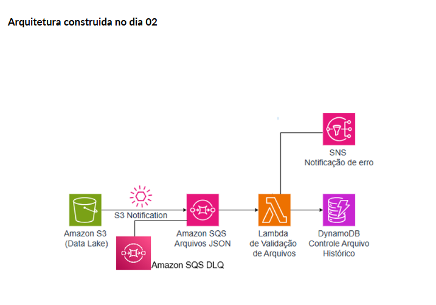
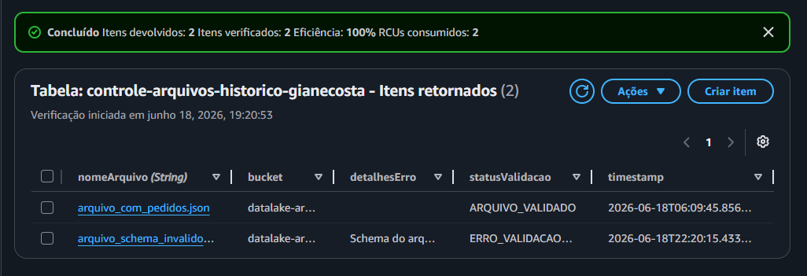
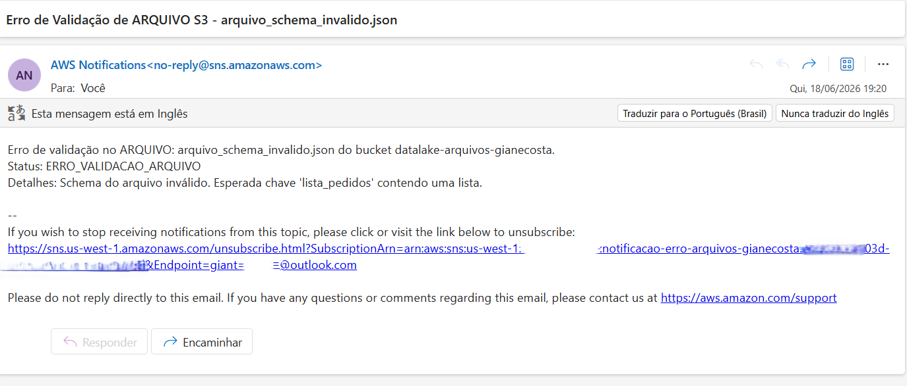

# 📁 Semana do Desenvolvedor AWS – Dia 2

**Instrutor:** Rafael Silva Willians (Escola da Nuvem)

## 🎯 Ingestão de Arquivos via S3, Rastreamento e Integração com o Fluxo Principal
O objectivo deste segundo laboratório foi implementar um canal alternativo e assíncrono para a entrada de pedidos: o processamento em lote (*batch*) de arquivos JSON enviados para um repositório de dados (Amazon S3 Data Lake). 

Esta arquitetura garante que a aplicação consiga integrar dados recebidos de sistemas externos ou cargas massivas sem impactar o endpoint da API em tempo real desenvolvido no Dia 1.

## 📊 Diagrama da Solução
Abaixo está a representação visual da esteira serverless orientada a eventos e integrada de ponta a ponta:

### 🏗️ Arquitetura Desenvolvida
Quando um arquivo `.json` é carregado no bucket do S3, uma notificação de evento é disparada automaticamente para uma fila SQS Standard. Uma função Lambda processa essa fila, valida o schema do arquivo e faz o *split* dos pedidos válidos, encaminhando-os diretamente para a fila SQS FIFO principal da nossa esteira de produção. O histórico é salvo no DynamoDB e falhas graves disparam alertas via SNS.

### 🛠️ Serviços e Recursos AWS Provisionados:
* **IAM Role:** `lambda-s3-validation-role-giane-costa` com políticas *inline* personalizadas de privilégio mínimo.
* **Amazon S3 Bucket:** `datalake-arquivos-giane-costa` atuando como a camada de armazenamento dos arquivos brutos.
* **Amazon SQS (Standard & DLQ):** `s3-arquivos-json-queue-giane-costa` e sua respectiva Dead-Letter Queue para desacoplamento resiliente do gatilho do S3.
* **AWS Lambda (Python 3.12):** `validacao-s3-arquivos-lambda-giane-costa` contendo a lógica de parseamento, validação estrutural e roteamento dos pedidos.
* **Amazon DynamoDB:** `controle-arquivos-historico-giane-costa` (Partition Key: `nomeArquivo`) para auditoria e rastreamento de status de processamento.
* **Amazon SNS Topic:** `notificacao-erro-arquivos-giane-costa` integrado via subscrição de e-mail para alertas imediatos de arquivos com schemas inválidos.

## ✅ Validação e Testes de Integração

### 1. Cenário de Sucesso (`arquivo_com_pedidos.json`)
* Upload efetuado contendo múltiplos pedidos válidos.
* **DynamoDB:** Registro criado com status `ARQUIVO_VALIDADO`.
* **SQS FIFO Principal:** Pedidos extraídos com sucesso, transformados com IDs únicos (`uuid4`) e integrados de forma transparente à esteira de processamento central da arquitetura.

*(Evidência de sucesso do processamento armazenada na tabela NoSQL do DynamoDB)*

### 2. Cenário de Falha (`arquivo_schema_invalido.json`)
* Upload de arquivo com chaves fora do padrão esperado pelo sistema.
* **DynamoDB:** Registro capturado e atualizado com o status `ERRO_VALIDACAO_ARQUIVO`.
* **Amazon SNS:** Disparo imediato de e-mail de alerta notificando o erro crítico de validação do arquivo carregado no Data Lake.

*(Alerta de violação de schema enviado em tempo real via SNS para a equipe de engenharia)*

---
🧑‍💻 **Autora:** Giane Costa  
🎓 **Formação:** Escola da Nuvem  
☁️ **Especialização:** AWS Developer Associate